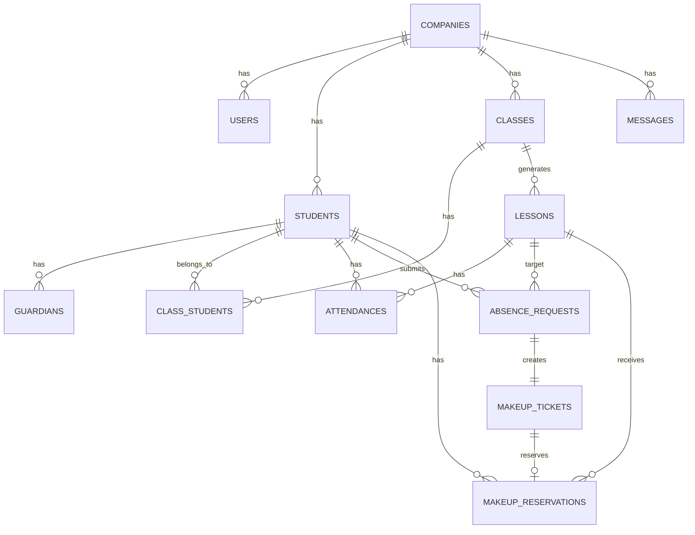

# 06. ER図・テーブル同士の関係

## 全体像

ClassFlow Mini の中心は、以下の関係です。

```text
生徒が欠席する
↓
欠席登録が作成される
↓
振替チケットが発行される
↓
振替予約で別レッスンに紐づく
↓
出席したらチケットが消化される
```

---

## テーブル関係の全体イメージ

```text
companies
  ├── users
  ├── students
  │     └── guardians
  │
  ├── classes
  │     ├── class_students
  │     └── lessons
  │           └── attendances
  │
  ├── absence_requests
  │     └── makeup_tickets
  │           └── makeup_reservations
  │
  └── messages
```

---

## 主要なリレーション

### companies と users

```text
companies 1 ── 多 users
```

1つの教室に複数の管理者・講師が所属します。

---

### companies と students

```text
companies 1 ── 多 students
```

1つの教室に複数の生徒が所属します。

---

### students と guardians

```text
students 1 ── 多 guardians
```

1人の生徒に複数の保護者を登録できるようにします。

---

### students と classes

```text
students 多 ── 多 classes
```

生徒は複数クラスに所属する可能性があります。

クラスにも複数の生徒がいます。

そのため、中間テーブル `class_students` を使います。

```text
students 1 ── 多 class_students
classes  1 ── 多 class_students
```

---

### classes と lessons

```text
classes 1 ── 多 lessons
```

`classes` は曜日・時間のテンプレートです。

`lessons` は実際の日付ごとのレッスンです。

例：

```text
キッズダンス初級 火曜17:00
  ├── 2026/06/02 のレッスン
  ├── 2026/06/09 のレッスン
  └── 2026/06/16 のレッスン
```

---

### lessons と attendances

```text
lessons 1 ── 多 attendances
students 1 ── 多 attendances
```

出欠は、どの生徒がどのレッスンに参加したかを表します。

---

### students / lessons と absence_requests

```text
students 1 ── 多 absence_requests
lessons  1 ── 多 absence_requests
```

欠席登録は、どの生徒がどのレッスンを欠席したかを表します。

---

### absence_requests と makeup_tickets

```text
absence_requests 1 ── 1 makeup_tickets
```

1回欠席したら、1枚の振替チケットを発行します。

MVPでは、以下のルールにします。

```text
1欠席 = 1振替チケット
```

---

### makeup_tickets と makeup_reservations

```text
makeup_tickets 1 ── 0 or 1 makeup_reservations
```

1枚の振替チケットは、まだ予約されていない場合があります。

予約されたら `makeup_reservations` が1件作成されます。

---

### lessons と makeup_reservations

```text
lessons 1 ── 多 makeup_reservations
```

1つのレッスンに複数の振替参加者が入る可能性があります。

---

## Mermaid ER図

GitHubのREADMEやMarkdownビューアで表示しやすい形式です。



---

## 一番重要な中心構造

まず覚えるべきは以下です。

```text
students
  ↓
absence_requests
  ↓
makeup_tickets
  ↓
makeup_reservations
  ↓
lessons
```

意味はこうです。

```text
生徒が欠席する
↓
欠席登録ができる
↓
振替チケットが発行される
↓
別日のレッスンに振替予約する
↓
そのレッスンに振替参加する
```

---

## 振替状態の変化

振替チケットの状態は、以下のように変化します。

```text
unused
↓ 振替予約する
reserved
↓ 振替で出席する
used
```

キャンセルや期限切れの場合は以下です。

```text
unused
↓ 期限を過ぎる
expired
```

```text
reserved
↓ 予約キャンセル
unused
```

```text
unused
↓ 管理者が無効化
cancelled
```
